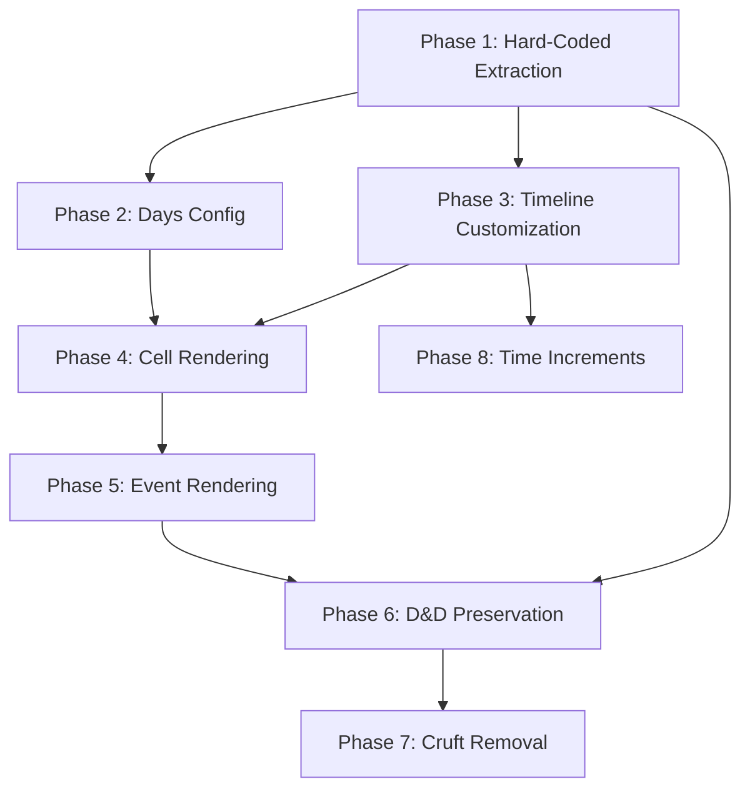

# flutter_customizable_calendar Fork Customization Plan

## Executive Summary

This document outlines a multi-phase plan to strip down the flutter_customizable_calendar library to enable **fully customizable UX** for Month/Week/Day views while **preserving drag-and-drop functionality**. The goal is to eliminate hard-coded theming, skinning, and layout decisions that limit flexibility.

---

## Current Architecture Analysis

### Package Structure
```
lib/
├── flutter_customizable_calendar.dart    # Main export
├── src/
│   ├── domain/models/                    # Event models (CalendarEvent, Break, TaskDue, etc.)
│   ├── ui/
│   │   ├── controllers/                  # View state management (BLoC pattern)
│   │   ├── custom_widgets/               # Reusable UI components
│   │   ├── themes/                       # Theme configuration classes
│   │   └── views/                        # Main view widgets (Days, Week, Month, Schedule)
│   ├── utils/                            # Helpers, extensions, constants
│   └── custom/                           # Custom scroll controller
```

### Key Dependencies
- `flutter_bloc: ^8.1.3` - State management
- `scrollable_positioned_list: ^0.3.8` - Virtual scrolling
- `animations: ^2.0.8` - Smooth transitions
- `intl: ^0.18.1` - Date formatting

---

## Phase 1: Hard-Coded Value Extraction (Foundation)

### Objective
Extract ALL hard-coded values into theme/configuration objects to enable runtime customization.

### 1.1 Timeline & Grid Hard-Coded Values

| Location | Hard-Coded Value | Current | Action |
|----------|------------------|---------|--------|
| `week_view_timeline_page.dart:195-196` | Timeline height | `2400px` | Make dynamic: `hourExtent * 24` |
| `week_view_timeline_page.dart:384-386` | Grid stripe colors | `grey.withOpacity(0.1)` | Add to theme |
| `events_layout.dart:444` | Event cluster offset | `10.0px` | Add to `TimelineTheme` |
| `events_layout.dart:283` | Month margin | `EdgeInsets.only(bottom: 2)` | Add to theme |
| `events_layout.dart:349` | Show more button height | `24px` | Already in MonthShowMoreTheme |
| `schedule_list_view.dart:369` | Date widget width | `64px` | Add to `ScheduleListViewTheme` |

### 1.2 Animation Duration Hard-Coded Values

| Location | Duration | Context | Action |
|----------|----------|---------|--------|
| `days_view.dart:233` | `100ms` | Auto-scroll | Add to AnimationConfig |
| `days_view.dart:298` | `450ms` | Day selection | Add to AnimationConfig |
| `days_view.dart:318` | `150ms` | Month picker | Add to AnimationConfig |
| `days_view.dart:330` | `300ms` | Days list | Add to AnimationConfig |
| `week_view.dart:269` | `100ms` | Timeline auto-scroll | Add to AnimationConfig |
| `week_view.dart:314` | `400ms` | Week navigation | Add to AnimationConfig |
| `schedule_list_view.dart:337` | `300ms` | Scroll animation | Add to AnimationConfig |
| `days_list_item.dart:68` | `150ms` | Selection animation | Add to AnimationConfig |

### 1.3 Drag-Drop Critical Constants

| Location | Value | Purpose | Preserve? |
|----------|-------|---------|-----------|
| `days_view.dart:211-212` | `25px` | Auto-scroll detection area | Make configurable |
| `draggable_event_overlay.dart:191,792` | `/13` | Month grid columns | Needs refactoring |
| `draggable_event_overlay.dart:755,781` | `*24` | Hours per day | Keep (semantic constant) |
| `draggable_event_overlay.dart:791` | `*1.5` | Month row height multiplier | Make configurable |
| `draggable_event_overlay.dart:282-283` | `Duration(hours: 12)` | Month view noon default | Make configurable |

### 1.4 New Theme Classes to Create

```dart
/// New: Animation configuration
class CalendarAnimationConfig {
  final Duration autoScrollDuration;
  final Duration daySelectionDuration;
  final Duration monthPickerDuration;
  final Duration weekNavigationDuration;
  final Duration scrollAnimationDuration;
  final Curve autoScrollCurve;
  final Curve navigationCurve;
  // ... etc
}

/// New: Grid line configuration
class GridLineTheme {
  final bool showVerticalLines;
  final bool showHorizontalLines;
  final Color verticalLineColor;
  final Color horizontalLineColor;
  final double lineWidth;
  final double stripeOpacity;
  // Pattern support (solid, dashed, dotted)
}

/// New: Auto-scroll configuration
class DragScrollConfig {
  final double detectionArea;
  final double moveDistance;
  final Duration scrollInterval;
}
```

### 1.5 Deliverables
- [ ] Create `CalendarAnimationConfig` class
- [ ] Create `GridLineTheme` class
- [ ] Create `DragScrollConfig` class
- [ ] Migrate all hard-coded durations to AnimationConfig
- [ ] Update TimelineTheme to include GridLineTheme
- [ ] Update DraggableEventTheme to include DragScrollConfig
- [ ] Unit tests for new configuration classes

---

## Phase 2: Days Configuration & Flexibility

### Objective
Enable full control over which days appear and how they are displayed.

### 2.1 Current Limitations

| Issue | Location | Current Behavior |
|-------|----------|------------------|
| Fixed 7-day week | `extensions.dart:17-30` | `weekRange()` assumes Mon-Sun |
| Week starts on Monday | `extensions.dart:19-24` | Hard-coded Monday start |
| No weekday filtering | Various | No API to hide weekends |
| Days per page fixed | `week_view_controller.dart` | `visibleDays` limited to 1-7 |

### 2.2 Required Changes

```dart
/// Enhanced: Visible days configuration
class VisibleDaysConfig {
  /// Which days of week to show (1=Monday, 7=Sunday)
  final List<int> visibleWeekdays;

  /// First day of week (1=Monday, 7=Sunday)
  final int firstDayOfWeek;

  /// Number of days visible at once (for Week view)
  final int daysPerPage;

  /// Custom day filter function
  final bool Function(DateTime)? dayFilter;
}

/// Enhanced: Week extension
extension WeekUtils on DateTime {
  DateTimeRange weekRange(VisibleDaysConfig config) {
    // Configurable week start and visible days
  }
}
```

### 2.3 Files to Modify
- `lib/src/utils/extensions.dart` - Week calculation logic
- `lib/src/ui/controllers/week_view_controller.dart` - Accept VisibleDaysConfig
- `lib/src/ui/views/week_view/week_view.dart` - Pass config to children
- `lib/src/ui/views/week_view/week_view_timeline_page.dart` - Apply filtering

### 2.4 Deliverables
- [ ] Create `VisibleDaysConfig` class
- [ ] Refactor `WeekUtils.weekRange()` to accept config
- [ ] Update `WeekViewController` constructor
- [ ] Update week view rendering to filter days
- [ ] Add weekdays-only support to Month view
- [ ] Tests for day filtering edge cases

---

## Phase 3: Timeline & Date Header Customization

### Objective
Enable complete customization of timeline appearance, hour markers, and date headers.

### 3.1 Current Theme Capabilities (KEEP)

Already configurable in `TimeScaleTheme`:
- `width` - Time scale column width
- `hourExtent` - Pixels per hour (zoom level)
- `hourFormatter` - Hour text format
- `textStyle` - Hour text styling
- `drawHalfHourMarks` / `drawQuarterHourMarks` - Toggle marks
- `halfHourMarkTheme` / `quarterHourMarkTheme` - Mark styling
- `currentTimeMarkTheme` - Current time indicator
- `marksAlign` - Left/center/right alignment

### 3.2 Missing Customization Options

| Feature | Current State | Required |
|---------|---------------|----------|
| Custom time increments | Half/quarter only | 5, 10, 15, 20, 30 min |
| Hour range visibility | Full 24h always | Start/end hour config |
| Grid line rendering | Not implemented | Full grid line support |
| Header background | Transparent only | Themeable background |
| Time label position | Left only | Left/right/both |
| Non-hour labels | Hours only | Support 30-min labels |

### 3.3 Enhanced TimeScaleTheme

```dart
class TimeScaleTheme {
  // Existing properties...

  // NEW: Visible time range
  final int startHour;  // e.g., 6 (show from 6 AM)
  final int endHour;    // e.g., 22 (show until 10 PM)

  // NEW: Custom time increment marks
  final List<TimeMarkConfig> customMarks;

  // NEW: Label configuration
  final TimeScaleLabelPosition labelPosition;
  final bool showHalfHourLabels;
  final bool showCustomIncrementLabels;

  // NEW: Background
  final Color? backgroundColor;
  final Decoration? decoration;
}

class TimeMarkConfig {
  final int minuteInterval;  // e.g., 10, 15, 20, 30
  final TimeMarkTheme theme;
  final bool showLabel;
}

enum TimeScaleLabelPosition { left, right, both, none }
```

### 3.4 Enhanced DaysRowTheme

Already exists but add:
```dart
class DaysRowTheme {
  // Existing properties...

  // NEW: Layout options
  final Color? backgroundColor;
  final Decoration? decoration;
  final EdgeInsets contentPadding;

  // NEW: Day cell options
  final Widget Function(DateTime, bool isFocused)? dayBuilder;
  final bool showTodayIndicator;
  final Color? todayIndicatorColor;
}
```

### 3.5 Deliverables
- [ ] Add startHour/endHour to TimeScaleTheme
- [ ] Implement TimeMarkConfig for custom intervals
- [ ] Add TimeScaleLabelPosition enum
- [ ] Enhance DaysRowTheme with missing options
- [ ] Refactor TimeScale CustomPainter to use new config
- [ ] Update timeline rendering for partial day display

---

## Phase 4: Cell Rendering & Grid Theming

### Objective
Enable complete customization of how calendar cells and grids are rendered.

### 4.1 Current Cell Rendering

| View | Cell Rendering | Customization |
|------|----------------|---------------|
| Days | Single column, no explicit cells | Via TimelineTheme only |
| Week | Striped columns (grey/transparent) | Hard-coded colors |
| Month | MonthDayTheme controls | Moderate customization |

### 4.2 New GridCellTheme

```dart
class GridCellTheme {
  // Cell background
  final Color? cellBackground;
  final Color? alternatingCellBackground;
  final BoxDecoration? cellDecoration;

  // Cell borders
  final BorderSide? topBorder;
  final BorderSide? bottomBorder;
  final BorderSide? leftBorder;
  final BorderSide? rightBorder;

  // Cell sizing
  final double? minCellHeight;
  final double? maxCellHeight;

  // Hour line styling
  final BorderSide? hourLineBorder;
  final BorderSide? halfHourLineBorder;
  final BorderSide? quarterHourLineBorder;

  // Custom cell builder
  final Widget Function(DateTime, int hour, int minute)? cellBuilder;
}
```

### 4.3 Enhanced MonthDayTheme

Current `MonthDayTheme` has:
- `dayColor`, `currentDayColor`
- `dayNumberBackgroundColor`, `currentDayNumberBackgroundColor`
- `spacingColor`
- `dayNumberTextStyle`, `currentDayNumberTextStyle`
- `crossAxisSpacing`, `mainAxisSpacing`
- `dayNumberHeight`, `dayNumberMargin`, `dayNumberPadding`

Add:
```dart
class MonthDayTheme {
  // Existing properties...

  // NEW: Weekend styling
  final Color? weekendDayColor;
  final TextStyle? weekendDayNumberTextStyle;

  // NEW: Outside month styling
  final Color? outsideMonthDayColor;
  final TextStyle? outsideMonthDayTextStyle;
  final double outsideMonthOpacity;

  // NEW: Selection state
  final Color? selectedDayColor;
  final Color? selectedDayBorderColor;
  final double selectedDayBorderWidth;

  // NEW: Custom builders
  final Widget Function(DateTime, List<CalendarEvent>, bool isSelected)? dayBuilder;
}
```

### 4.4 Files to Modify
- `lib/src/ui/themes/timeline_theme.dart` - Add GridCellTheme
- `lib/src/ui/themes/month_day_theme.dart` - Enhance with new properties
- `lib/src/ui/views/week_view/week_view_timeline_page.dart` - Use GridCellTheme
- `lib/src/ui/views/days_view.dart` - Apply cell theming
- `lib/src/ui/views/month_view.dart` - Use enhanced MonthDayTheme

### 4.5 Deliverables
- [ ] Create `GridCellTheme` class
- [ ] Enhance `MonthDayTheme` with new properties
- [ ] Implement grid line rendering in Week view
- [ ] Add horizontal hour lines to Days/Week views
- [ ] Add cellBuilder support for full custom cells
- [ ] Tests for grid rendering

---

## Phase 5: Event Node Rendering Flexibility

### Objective
Enable complete customization of how events are rendered and positioned on the grid.

### 5.1 Current Event Rendering

**EventView** (`event_view.dart`) wraps events in a Card with:
- Color from event.color
- Elevation from theme
- Shape from theme
- Margin from theme

**EventsLayout** (`events_layout.dart`) positions events using:
- `CustomMultiChildLayout` delegate
- Hard-coded 10px cascade offset for overlapping events
- Minimum height based on cellExtent

### 5.2 Enhanced FloatingEventsTheme

```dart
class FloatingEventsTheme {
  // Existing properties...

  // NEW: Overlap behavior
  final double overlapCascadeOffset;  // Currently hard-coded 10.0
  final OverlapStrategy overlapStrategy;  // cascade, stack, side-by-side

  // NEW: Event container
  final BoxDecoration? containerDecoration;
  final Color? defaultEventColor;
  final EdgeInsets contentPadding;

  // NEW: Event content
  final TextStyle? titleStyle;
  final TextStyle? subtitleStyle;
  final bool showTime;
  final bool showDuration;

  // NEW: Sizing constraints
  final double? minEventHeight;
  final double? maxEventWidth;
}

enum OverlapStrategy {
  cascade,     // Current behavior - offset to right
  stack,       // Stack vertically
  sideBySide,  // Divide width equally
  custom,      // Use overlapBuilder
}
```

### 5.3 Event Positioning Configuration

```dart
class EventPositionConfig {
  /// Minimum visible duration in minutes
  final int minVisibleDuration;

  /// Snap events to grid
  final bool snapToGrid;

  /// Grid snap interval in minutes
  final int snapInterval;

  /// Event margin within cell
  final EdgeInsets eventMargin;

  /// Allow events to extend past visible hours
  final bool clipToVisibleHours;
}
```

### 5.4 Files to Modify
- `lib/src/ui/themes/floating_events_theme.dart` - Add new properties
- `lib/src/ui/custom_widgets/events_layout.dart` - Use config for positioning
- `lib/src/ui/custom_widgets/events/event_view.dart` - Apply enhanced theme

### 5.5 Deliverables
- [ ] Enhance `FloatingEventsTheme` with new properties
- [ ] Create `EventPositionConfig` class
- [ ] Make overlap cascade offset configurable
- [ ] Implement OverlapStrategy options
- [ ] Add event content customization
- [ ] Tests for event positioning

---

## Phase 6: Preserve Drag-and-Drop Functionality

### Objective
Ensure all drag-and-drop functionality continues to work correctly after customization changes.

### 6.1 Drag-Drop Dependencies (MUST PRESERVE)

| Component | Location | Critical For |
|-----------|----------|--------------|
| `FloatingEventNotifier` | `floating_event_notifier.dart` | Elevated event state |
| `DraggableEventOverlay` | `draggable_event_overlay.dart` | Main D&D logic |
| `RenderIdProvider` | `render_id_provider.dart` | Hit testing |
| `Constants.elevatedEventId` | `constants.dart` | Event identification |
| `Constants.sizerId` | `constants.dart` | Resize handle ID |
| `Constants.layoutId` | `constants.dart` | Layout hit testing |
| `RectNotifier` | `rect_notifier.dart` | Bounds tracking |

### 6.2 Critical Formulas (DO NOT MODIFY)

```dart
// Event time snapping (draggable_event_overlay.dart:378)
final roundedMinutes = (minutes / _cellExtent).round() * _cellExtent;

// Minute extent calculation (events_layout.dart:397)
final minuteExtent = size.height / Duration.minutesPerDay;

// Event vertical position (events_layout.dart:475)
event.start.difference(date).inMinutes * minuteExtent
```

### 6.3 Integration Points to Update

When modifying grid/timeline:
- Ensure `getTimelineBox()` returns correct RenderBox
- Ensure `getLayoutBox(DateTime)` returns day column RenderBox
- Ensure `getEventBox(T)` returns event widget RenderBox
- Keep RenderId markers on all draggable elements

### 6.4 Testing Checklist
- [ ] Long-press to initiate drag works
- [ ] Drag to new time position works
- [ ] Drag to new day works (Week view)
- [ ] Event resize via sizer handle works
- [ ] Auto-scroll during drag works
- [ ] Save/discard after drag works
- [ ] Multi-day event drag works (Week/Month)
- [ ] All callbacks fire correctly

---

## Phase 7: Cruft Identification & Removal

### Objective
Identify and optionally remove code that is unlikely to be useful for the target application.

### 7.1 Potential Cruft Analysis

| Component | Purpose | Likely Needed? | Recommendation |
|-----------|---------|----------------|----------------|
| `ScheduleListView` | Agenda-style list | Maybe | Keep as optional |
| `TaskDue` event type | Point-in-time task | Probably not | Flag for removal |
| `Break` event type | Non-editable block | Possibly | Keep, simplify |
| `DisplayedPeriodPicker` | Month/period picker | Yes | Keep |
| `Saver` widget | Save/confirm button | Maybe | Keep as optional |
| `AllDaysEventsList` | All-day events | Yes | Keep |
| `CustomLinkedScrollController` | Sync scrolling | Yes | Keep |

### 7.2 Event Types Review

**Keep:**
- `CalendarEvent` (base class)
- `FloatingCalendarEvent` (movable)
- `EditableCalendarEvent` (resizable)
- `AllDayCalendarEvent` (all-day)
- `SimpleEvent` (basic implementation)
- `SimpleAllDayEvent` (basic all-day)

**Review for Removal:**
- `TaskDue` - Specialized point-in-time event
- `Break` - Non-editable hatched block

### 7.3 Theme Classes Review

**Essential (Keep):**
- `TimelineTheme`
- `TimeScaleTheme`
- `TimeMarkTheme`
- `DaysRowTheme`
- `FloatingEventsTheme`
- `DraggableEventTheme`
- `SizerTheme`
- `AllDayEventsTheme`
- `MonthDayTheme`

**Review for Simplification:**
- `DisplayedPeriodPickerTheme` - Could simplify
- `DisplayedPeriodPickerButtonTheme` - Could simplify
- `DaysListTheme` / `DaysListItemTheme` - Could merge
- `ScheduleListViewTheme` - Only if keeping ScheduleListView
- `MonthShowMoreTheme` - Simple, keep

### 7.4 Cruft Removal Candidates List

```
Files to potentially remove:
- src/ui/custom_widgets/events/task_due_view.dart (if removing TaskDue)
- src/ui/custom_widgets/events/break_view.dart (if removing Break)

Classes to potentially simplify:
- Break class in calendar_event.dart
- TaskDue class in calendar_event.dart
- Multiple nested button themes
```

### 7.5 Deliverables
- [ ] Create `CRUFT_CANDIDATES.md` with detailed removal candidates
- [ ] Add feature flags for optional components
- [ ] Separate essential vs optional exports
- [ ] Test suite for core functionality without cruft

---

## Phase 8: Time Increment Flexibility

### Objective
Enable full control over time grid increments beyond the current 15/30/60 minute options.

### 8.1 Current Limitations

- `cellExtent` configurable 1-60 minutes (good)
- Only half-hour and quarter-hour marks drawn
- No support for 5, 10, 20 minute marks
- No support for arbitrary increment marks

### 8.2 Enhanced TimeMarkConfiguration

```dart
class TimeIncrementConfig {
  /// All time increments to display
  final List<TimeIncrement> increments;

  /// Whether to show labels for each increment
  final bool showIncrementLabels;
}

class TimeIncrement {
  /// Interval in minutes (5, 10, 15, 20, 30, 60, etc.)
  final int minutes;

  /// Visual theme for this increment's marks
  final TimeMarkTheme theme;

  /// Whether to show a label at this increment
  final bool showLabel;

  /// Label formatter (optional)
  final String Function(DateTime)? labelFormatter;
}
```

### 8.3 Implementation Changes

Modify `time_scale.dart` `_ScalePainter.paint()`:
```dart
@override
void paint(Canvas canvas, Size size) {
  final hourExtent = size.height / Duration.hoursPerDay;

  // Draw configured increments
  for (final increment in theme.increments) {
    final stepHeight = hourExtent * (increment.minutes / 60);
    final totalSteps = (Duration.minutesPerDay / increment.minutes).floor();

    for (var step = 0; step < totalSteps; step++) {
      final offset = step * stepHeight;
      // Draw mark at offset using increment.theme
    }
  }
}
```

### 8.4 Deliverables
- [ ] Create `TimeIncrementConfig` class
- [ ] Update `TimeScaleTheme` to use increments list
- [ ] Refactor `_ScalePainter` for arbitrary increments
- [ ] Add label support for non-hour marks
- [ ] Tests for custom increments

---

## Implementation Priority & Dependencies



### Recommended Order

1. **Phase 1** (Foundation) - Required first, enables all other phases
2. **Phase 6** (D&D Preservation) - Test early and often during development
3. **Phase 3** (Timeline) - High impact, enables Phase 8
4. **Phase 2** (Days Config) - Enables weekdays-only support
5. **Phase 4** (Cells) - Depends on timeline completion
6. **Phase 5** (Events) - Depends on cell rendering
7. **Phase 8** (Time Increments) - Depends on timeline refactoring
8. **Phase 7** (Cruft) - Do last, after core functionality confirmed

---

## Testing Strategy

### Unit Tests
- All new theme classes with default values
- TimeScaleTheme rendering with various configs
- Day filtering logic
- Event positioning calculations

### Widget Tests
- DaysView with custom TimelineTheme
- WeekView with weekdays-only config
- MonthView with custom cell builders
- Event rendering with various themes

### Integration Tests
- Full drag-and-drop workflow after changes
- Navigation between views
- State persistence across view changes

### Manual Testing Checklist
- [ ] All hard-coded values now configurable
- [ ] Days view renders correctly with custom theme
- [ ] Week view shows only selected weekdays
- [ ] Month view hides weekends when configured
- [ ] Timeline shows custom time increments
- [ ] Grid lines render with custom theme
- [ ] Events position correctly on custom grids
- [ ] Drag-and-drop works in all views
- [ ] Event resize works correctly
- [ ] Auto-scroll during drag works
- [ ] Animations use configured durations

---

## Summary

This plan transforms flutter_customizable_calendar from a partially-customizable library into a fully-flexible calendar framework by:

1. **Extracting** all hard-coded values into theme configurations
2. **Adding** new theme classes for previously non-customizable elements
3. **Enabling** day filtering and flexible week configurations
4. **Preserving** the robust drag-and-drop functionality
5. **Simplifying** by identifying and optionally removing unused features

The result will be a calendar component that can match any design system while maintaining full interactive editing capabilities.
